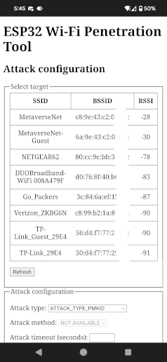

 

## 🌟 Still Under Testing 04/04/24 🌟

<b>Thought I'd make it easy for those wanting to try out "ESP32 Wi-Fi Penetration Tool" by <a href="https://github.com/risinek/esp32-wifi-penetration-tool">"risinek"</a>. This is a universal tool for ESP32 boards  and it allows implementing various Wi-Fi attacks. It's a simple parts list to put together and can be built in under 20 mins without a case.   </b>
  
### More info about "ESP32 Wi-Fi Penetration Tool" can be located <a href="https://github.com/risinek/esp32-wifi-penetration-tool">HERE</a>.  
  

  

   

  ## Usage
1. Use the link below in google chrome to flash the project onto ESP32 (DevKit or module)
1. Power ESP32
1. Management AP will display in your cell phones available wifi networks within 60 seconds of powering on the ESP32.
1. Connect to this AP\
By default: 
*SSID:* `ManagementAP` and *password:* `mgmtadmin`
1. In a browser like brave or chrome on cell phone open `192.168.4.1` and you should see a web client to configure and control tool like this:

  
Simple Flash Method: <a href=https://atomnft.github.io/ESP32-Wi-Fi-Penetration-Tool/flash0.html>ESP32 Wi-Fi Penetration Tool Flasher</a>